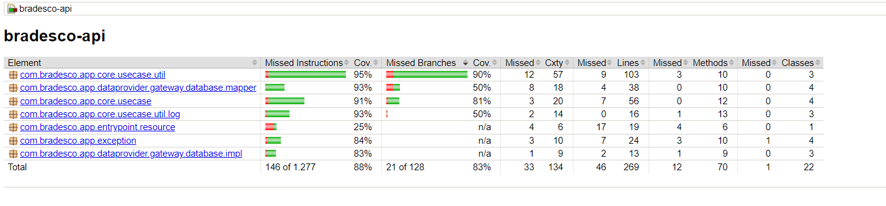
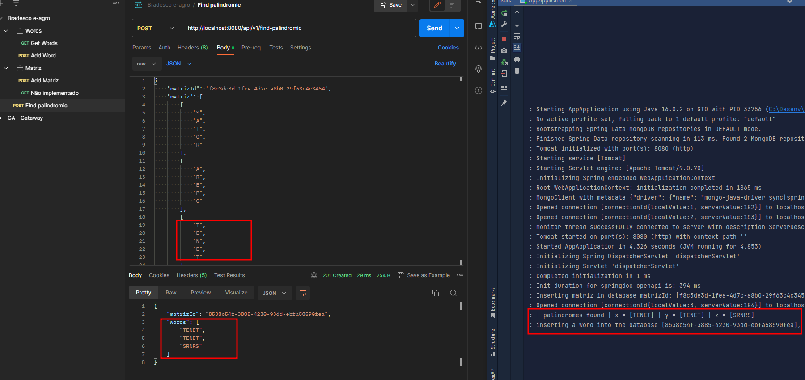

# Aplicação de caça polindromos

## Como rodar o projeto local
1. Entrar na raiz do diretório docker/
2. Executar ````docker-compose up````
3. Após isso executar aplicação `mvn spring-boot:run` ou executar a classe AppApplication.

## Swagger UI
- [http://localhost:8080/swagger-ui/index.html](http://localhost:8080/swagger-ui/index.html)
- Para acessar swagger OpenAPI generator entre no diretório resources/swagger/swagger.yaml

## Mongo DB
- [http://localhost:8081/](http://localhost:8081/)

## Comandos Maven

- Instalar pacotes e rodar testes da aplicação `mvn clean install`

- Rodar cobertura de testes jacoco `mvn clean verify`

## Cobertura de testes


## Cenários de testes


